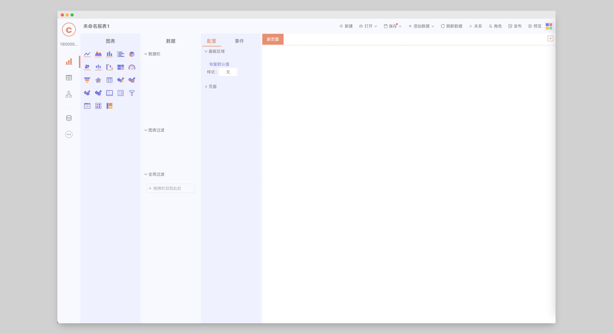
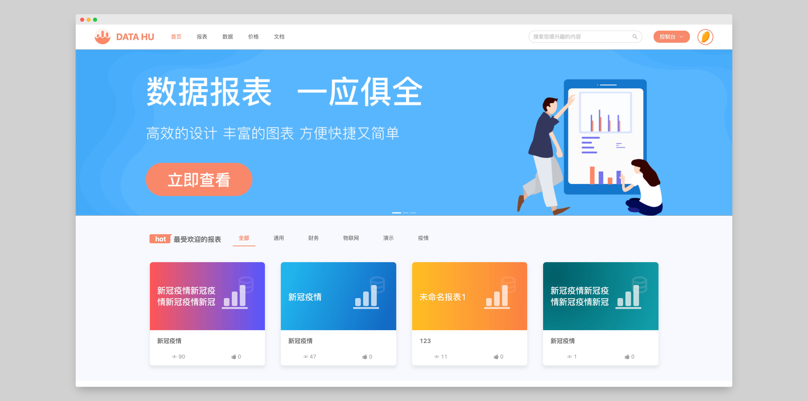

# 什么是 Data Hu

Data Hu 是一个数据收集与报表发布共享平台，您可以在 Data Hu 中查找您需要的数据， 使用这些数据设计您自己的报表， 并发布分享出来。

## Data Hu 的组成

Data Hu 由桌面端报表设计工具和 Web 端报表发布共享网站组成，桌面端用于进行报表的设计， Web 端用于设计完成后报表的发布和展示。

桌面端报表设计工具

Web 端报表发布共享网站

